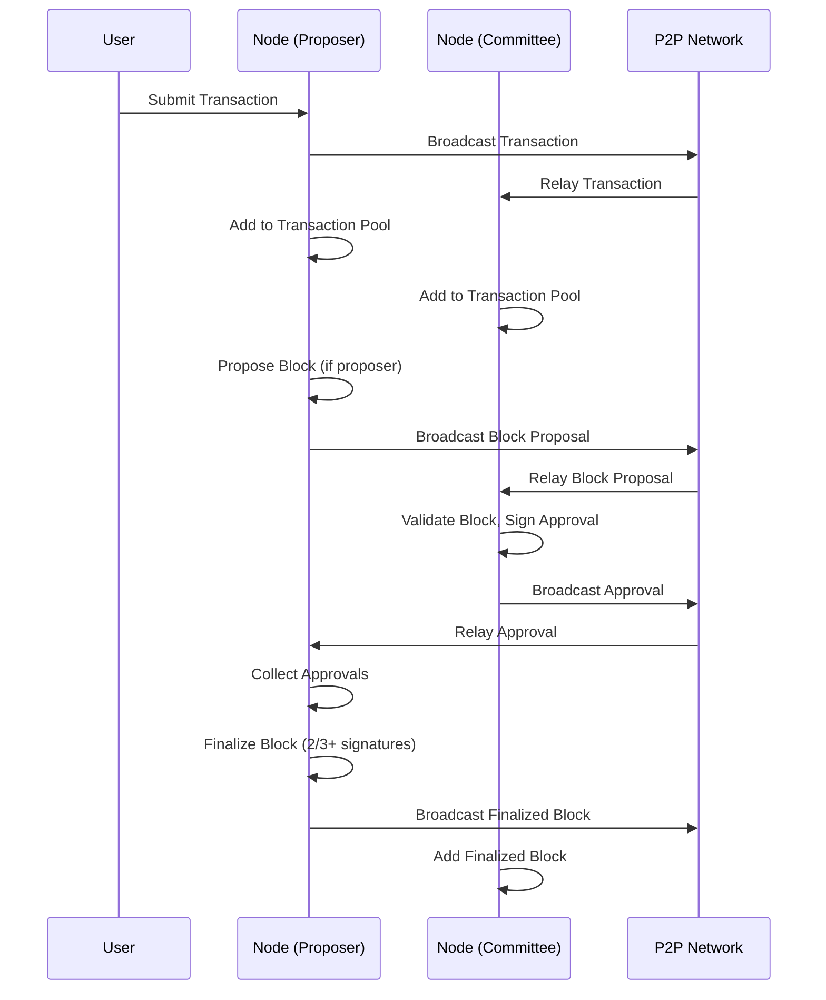

# dyphira-L1 DPoS Blockchain - Technical Documentation

## Table of Contents
- [Architecture Overview](#architecture-overview)
- [Component Diagram](#component-diagram)
- [Data Flow](#data-flow)
- [Core Data Structures](#core-data-structures)
- [Networking Layer](#networking-layer)
- [Consensus: DPoS, Committee, and Block Approval](#consensus-dpos-committee-and-block-approval)
- [Blockchain and Storage](#blockchain-and-storage)
- [State Management](#state-management)
- [Transaction Pool](#transaction-pool)
- [Validator Registry](#validator-registry)
- [Extending the System](#extending-the-system)

---

## Architecture Overview

The system is a modular, event-driven blockchain node implementing Delegated Proof-of-Stake (DPoS) consensus. It is composed of the following main subsystems:

- **P2P Networking**: Handles peer discovery, message propagation, and topic-based pub/sub using libp2p.
- **Blockchain**: Manages block creation, validation, and storage.
- **State**: Maintains account balances and nonces using a Merkle Trie.
- **Transaction Pool**: Validates and pools transactions before block inclusion.
- **Validator Registry**: Tracks validator registration, stake, and reputation.
- **Consensus**: Selects committees, rotates proposers, and finalizes blocks via multi-signature approval.

---

## Component Diagram

```mermaid
graph TD
  subgraph Node
    A[AppNode]
    B[P2PNode]
    C[Blockchain]
    D[State]
    E[TransactionPool]
    F[ValidatorRegistry]
    G[Committee/ProposerSelector]
    H[BlockApproval]
  end
  A -->|uses| B
  A -->|uses| C
  A -->|uses| D
  A -->|uses| E
  A -->|uses| F
  A -->|uses| G
  A -->|uses| H
  B <--> B2[P2PNode (other nodes)]
  B -->|pub/sub| A
  C -->|stores| D
  G -->|selects| H
  H -->|finalizes| C
  E -->|feeds txs| C
  F -->|provides| G
```

---

## Data Flow

### Transaction Propagation and Block Finalization



---

## Core Data Structures

### Block
- Header: block number, previous hash, timestamp, proposer, transaction root, hash
- Transactions: list of transactions
- ValidatorList: committee for the block
- Signature: proposer's signature

### Transaction
- From, To, Value, Nonce, Fee, Timestamp, Signature (R, S), Hash

### Validator
- Address, Stake, DelegatedStake, ComputeReputation

### Approval
- BlockHash, Address, Signature

### State
- Merkle Trie mapping addresses to account data

---

## Networking Layer

- **Library**: [libp2p](https://github.com/libp2p/go-libp2p)
- **Transport**: TCP
- **Peer Discovery**: Kademlia DHT
- **Pub/Sub**: GossipSub
- **Topics**:
  - `/dyphira/transactions/v1` (transactions)
  - `/dyphira/blocks/v1` (block proposals)
  - `/dyphira/approvals/v1` (block approvals)

### P2PNode
- Manages libp2p host, pubsub, DHT
- Registers topics, subscribes to messages, handles peer connections
- Discovers peers and maintains connections

---

## Consensus: DPoS, Committee, and Block Approval

### Committee Selection
- Every epoch (10 blocks), a new committee is selected
- Selection is weighted by stake, delegated stake, and reputation
- Top N validators are chosen (N = committee size)

### Proposer Selection
- Round-robin rotation within the committee
- Proposer creates and broadcasts block proposals

### Block Approval
- Committee members validate and sign block proposals
- Each approval is a digital signature over the block hash
- Block is finalized when >=2/3 of committee have signed
- Inactivity is tracked; inactive validators can be replaced

---

## Blockchain and Storage

- **Blockchain**: Sequence of blocks, each referencing the previous
- **Storage**: Pluggable (BoltDB for persistence, MemoryStore for testing)
- **Genesis Block**: Created at chain initialization
- **Block Size Limit**: 256MB

### Block Creation
- Proposer collects transactions from the pool
- Creates block header and computes Merkle root of transactions
- Signs block header
- Broadcasts block proposal

### Block Validation
- Check proposer, signatures, and transaction validity
- Only finalized blocks (with enough approvals) are added to the chain

---

## State Management

- **State**: Account balances and nonces stored in a Merkle Trie
- **ApplyTransaction**: Updates sender and recipient balances, increments nonce
- **ApplyBlock**: Applies all transactions in a block to the state
- **pubKeyToAddress**: Derives address from public key (last 20 bytes)

---

## Transaction Pool

- **AddTransaction**: Validates signature, nonce, and balance
- **SelectTransactions**: Picks up to N transactions for block inclusion
- **RemoveTransaction**: Removes included or invalid transactions

---

## Validator Registry

- **RegisterValidator**: Adds a validator to the registry
- **UpdateStake/DelegateStake/UpdateReputation**: Modifies validator properties
- **ListValidators**: Returns all registered validators

---

## Extending the System

- **Consensus**: Change committee selection or approval logic in `committee.go` and `block_approval.go`
- **State**: Add new account types or smart contract logic in `state.go` and `merkle_trie.go`
- **Networking**: Add new message types or topics in `p2p.go` and `node.go`
- **APIs**: Add RPC/REST endpoints for external interaction
- **Storage**: Implement new storage backends by extending the `IBlockStore` interface

---

## References
- [libp2p Documentation](https://docs.libp2p.io/)
- [BoltDB Documentation](https://pkg.go.dev/go.etcd.io/bbolt)
- [DPoS Consensus Overview](https://en.wikipedia.org/wiki/Delegated_proof_of_stake) 