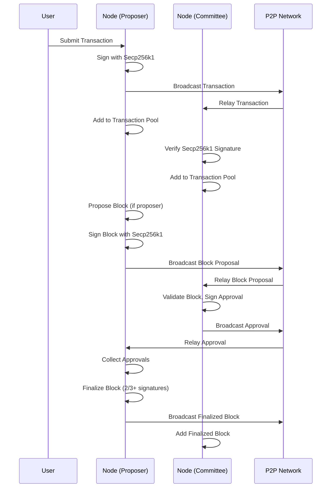

# dyphira-L1 DPoS Blockchain - Technical Documentation

## Table of Contents
- [Architecture Overview](#architecture-overview)
- [Component Diagram](#component-diagram)
- [Data Flow](#data-flow)
- [Core Data Structures](#core-data-structures)
- [Cryptographic Implementation](#cryptographic-implementation)
- [Networking Layer](#networking-layer)
- [Consensus: DPoS, Committee, and Block Approval](#consensus-dpos-committee-and-block-approval)
- [Blockchain and Storage](#blockchain-and-storage)
- [State Management](#state-management)
- [Transaction Pool](#transaction-pool)
- [Validator Registry](#validator-registry)
- [Transaction Batching](#transaction-batching)
- [Fast Sync Protocol](#fast-sync-protocol)
- [Metrics Collection](#metrics-collection)
- [Graceful Shutdown](#graceful-shutdown)
- [Extending the System](#extending-the-system)

---

## Architecture Overview

The system is a modular, event-driven blockchain node implementing Delegated Proof-of-Stake (DPoS) consensus. It is composed of the following main subsystems:

- **P2P Networking**: Handles peer discovery, message propagation, and topic-based pub/sub using libp2p.
- **Blockchain**: Manages block creation, validation, and storage.
- **State**: Maintains account balances and nonces using a Merkle Trie.
- **Transaction Pool**: Validates and pools transactions before block inclusion.
- **Validator Registry**: Tracks validator registration, stake, and reputation.
- **Consensus**: Selects committees, rotates proposers, and finalizes blocks via multi-signature approval.
- **Cryptography**: Secp256k1 key generation, signing, and address derivation.

---

## Component Diagram

```mermaid
graph TD
  subgraph Node
    A[AppNode]
    B[P2PNode]
    C[Blockchain]
    D[State]
    E[TransactionPool]
    F[ValidatorRegistry]
    G[Committee/ProposerSelector]
    H[BlockApproval]
    I[Cryptography]
  end
  A -->|uses| B
  A -->|uses| C
  A -->|uses| D
  A -->|uses| E
  A -->|uses| F
  A -->|uses| G
  A -->|uses| H
  A -->|uses| I
  B <--> B2[P2PNode (other nodes)]
  B -->|pub/sub| A
  C -->|stores| D
  G -->|selects| H
  H -->|finalizes| C
  E -->|feeds txs| C
  F -->|provides| G
  I -->|signs| A
  I -->|verifies| E
```

---

## Data Flow

### Transaction Propagation and Block Finalization



---

## Core Data Structures

### Block
- Header: block number, previous hash, timestamp, proposer, transaction root, hash
- Transactions: list of transactions
- ValidatorList: committee for the block
- Signature: proposer's Secp256k1 signature (ASN.1-encoded)

### Transaction
- From, To, Value, Nonce, Fee, Timestamp, Signature (ASN.1-encoded), Hash
- All addresses are BECH-32 encoded for display

### Validator
- Address (BECH-32 encoded), Stake, DelegatedStake, ComputeReputation

### Approval
- BlockHash, Address (BECH-32 encoded), Signature (ASN.1-encoded)

### State
- Merkle Trie mapping addresses to account data
- Addresses derived from Secp256k1 public keys

---

## Cryptographic Implementation

### Key Generation and Management
- **Private Keys**: Secp256k1 private keys (Ethereum-compatible)
- **Public Keys**: Derived from private keys using Secp256k1 curve
- **Key Storage**: Secure storage of private keys for signing operations

### Address Derivation Pipeline
Addresses are derived using a multi-step process:

1. **Public Key Serialization**: Compressed Secp256k1 public key (33 bytes)
2. **Whirlpool Hashing**: 32-byte hash of the public key
3. **RIPEMD-160 Hashing**: 20-byte hash of the Whirlpool result
4. **BECH-32 Encoding**: Human-readable address format with "dyphira" prefix

```go
// Address derivation example
func pubKeyToAddress(pubKey *btcec.PublicKey) Address {
    // Serialize public key (compressed format)
    pubKeyBytes := pubKey.SerializeCompressed()
    
    // Whirlpool hash (32 bytes)
    whirlpoolHash := whirlpool.Sum(pubKeyBytes)
    
    // RIPEMD-160 hash (20 bytes)
    ripemdHash := ripemd160.Sum(whirlpoolHash[:])
    
    // Return as 20-byte address
    return Address(ripemdHash)
}

// BECH-32 encoding for display
func addressToBech32(addr Address) string {
    return bech32.Encode("dyphira", addr[:])
}
```

### Transaction Signing and Verification
- **Hash Algorithm**: SHA-3 (Keccak-256) for transaction hashing
- **Signature Algorithm**: Secp256k1 ECDSA
- **Signature Format**: ASN.1-encoded DER format
- **Verification**: Public key recovery and signature verification

```go
// Transaction signing
func (tx *Transaction) Sign(privKey *btcec.PrivateKey) error {
    // Create transaction hash
    hash := tx.Hash()
    
    // Sign with Secp256k1
    sig := ecdsa.Sign(privKey, hash[:])
    
    // Serialize to ASN.1 format
    tx.Signature = sig.Serialize()
    return nil
}

// Transaction verification
func (tx *Transaction) VerifySignature() bool {
    // Recover public key from signature
    pubKey, err := ecdsa.RecoverCompact(tx.Signature, tx.Hash()[:])
    if err != nil {
        return false
    }
    
    // Derive address from public key
    expectedAddr := pubKeyToAddress(pubKey)
    
    // Compare with transaction sender
    return bytes.Equal(expectedAddr[:], tx.From[:])
}
```

### Block Signing and Verification
- **Block Hash**: SHA-256 of block header
- **Proposer Signature**: Secp256k1 ECDSA signature by block proposer
- **Committee Approvals**: Multiple Secp256k1 signatures from committee members

---

## Networking Layer

- **Library**: [libp2p](https://github.com/libp2p/go-libp2p)
- **Transport**: TCP
- **Peer Discovery**: Kademlia DHT
- **Pub/Sub**: GossipSub
- **Topics**:
  - `/dyphira/transactions/v1` (transactions)
  - `/dyphira/blocks/v1` (block proposals)
  - `/dyphira/approvals/v1` (block approvals)

### P2PNode
- Manages libp2p host, pubsub, DHT
- Registers topics, subscribes to messages, handles peer connections
- Discovers peers and maintains connections

---

## Consensus: DPoS, Committee, and Block Approval

### Committee Selection
- Every epoch (10 blocks), a new committee is selected
- Selection is weighted by stake, delegated stake, and reputation
- Top N validators are chosen (N = committee size)
- All committee members must have valid Secp256k1 keys

### Proposer Selection
- Round-robin rotation within the committee
- Proposer creates and broadcasts block proposals
- Block proposals are signed with proposer's Secp256k1 private key

### Block Approval
- Committee members validate and sign block proposals
- Each approval is a Secp256k1 digital signature over the block hash
- Signatures are ASN.1-encoded for transmission
- Block is finalized when >=2/3 of committee have signed
- Inactivity is tracked; inactive validators can be replaced

---

## Blockchain and Storage

- **Blockchain**: Sequence of blocks, each referencing the previous
- **Storage**: Pluggable (BoltDB for persistence, MemoryStore for testing)
- **Genesis Block**: Created at chain initialization
- **Block Size Limit**: 256MB

### Block Creation
- Proposer collects transactions from the pool
- Creates block header and computes Merkle root of transactions
- Signs block header with Secp256k1 private key
- Broadcasts block proposal with ASN.1-encoded signature

### Block Validation
- Check proposer, Secp256k1 signatures, and transaction validity
- Verify all transaction signatures using Secp256k1
- Only finalized blocks (with enough approvals) are added to the chain

---

## State Management

- **State**: Account balances and nonces stored in a Merkle Trie
- **ApplyTransaction**: Updates sender and recipient balances, increments nonce
- **ApplyBlock**: Applies all transactions in a block to the state
- **Address Derivation**: Uses the complete pipeline (Secp256k1 → Whirlpool → RIPEMD-160 → BECH-32)

---

## Transaction Pool

- **AddTransaction**: Validates Secp256k1 signature, nonce, and balance
- **SelectTransactions**: Picks up to N transactions for block inclusion
- **RemoveTransaction**: Removes included or invalid transactions
- **Signature Verification**: All transactions are verified using Secp256k1

---

## Validator Registry

- **RegisterValidator**: Adds a validator to the registry
- **UpdateStake/DelegateStake/UpdateReputation**: Modifies validator properties
- **GetAllValidators**: Returns all registered validators
- **Key Management**: Validators must have valid Secp256k1 key pairs

---

## Transaction Batching

- **Purpose**: Groups transactions into batches for efficient block production and throughput.
- **Batcher Logic**: Maintains a current batch, adds transactions until batch size or timeout is reached, then processes the batch.
- **Configuration**: Batch size and timeout are configurable.
- **Metrics**: Exposes batch size, processing time, throughput, and success rate.
- **Integration**: Used by the block producer to select transactions for new blocks.

---

## Fast Sync Protocol

- **Purpose**: Rapidly synchronizes a new node to the latest block height/state.
- **How it works**:
  - On startup, if the node is far behind, it requests state snapshots and block streams from peers.
  - Applies state and blocks in order until caught up.
  - Switches to normal sync once up-to-date.
- **Integration**: Managed by `FastSyncManager`, triggered automatically or via API.

---

## Metrics Collection

- **Purpose**: Collects and exports node, network, consensus, and performance metrics.
- **Metrics Collected**: Peer count, block height, committee size, approval rate, transaction pool size, memory usage, goroutines, syncing status, and more.
- **Export**: Metrics are exported as JSON (see `metrics.go`).
- **Integration**: Metrics are periodically collected and can be queried or exported for monitoring.

---

## Graceful Shutdown

- **Purpose**: Ensures all node components shut down cleanly and in the correct order.
- **How it works**:
  - Handles OS signals or API shutdown requests.
  - Coordinates shutdown of P2P, blockchain, batcher, metrics, etc.
  - Reports shutdown status and reason.
- **Integration**: Managed by `GracefulShutdown`, can be triggered by signal or API.

---

## Extending the System (updated)

- **Batching**: Tune or extend transaction batching logic in `transaction_batching.go`.
- **Fast Sync**: Modify or extend fast sync protocol in `fast_sync.go`.
- **Metrics**: Add new metrics or export formats in `metrics.go`.
- **Shutdown**: Add new shutdown hooks or status reporting in `graceful_shutdown.go`.

---

## References
- [libp2p Documentation](https://docs.libp2p.io/)
- [BoltDB Documentation](https://pkg.go.dev/go.etcd.io/bbolt)
- [DPoS Consensus Overview](https://en.wikipedia.org/wiki/Delegated_proof_of_stake)
- [Secp256k1 Documentation](https://github.com/btcsuite/btcd/tree/master/btcec)
- [BECH-32 Specification](https://github.com/bitcoin/bips/blob/master/bip-0173.mediawiki) 